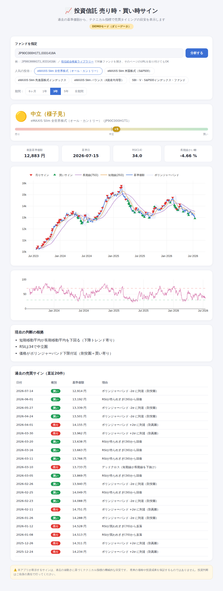
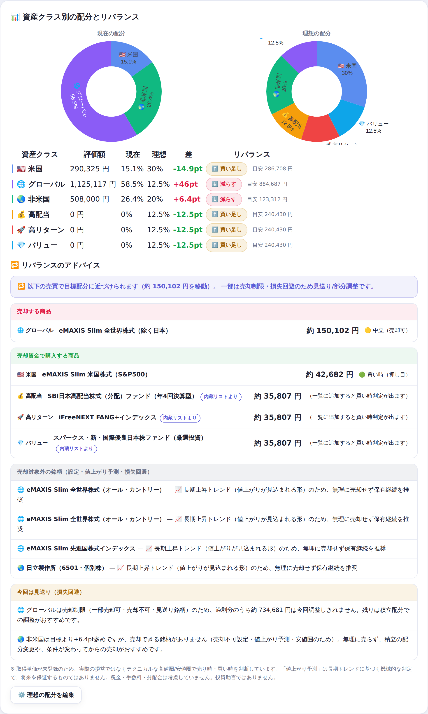
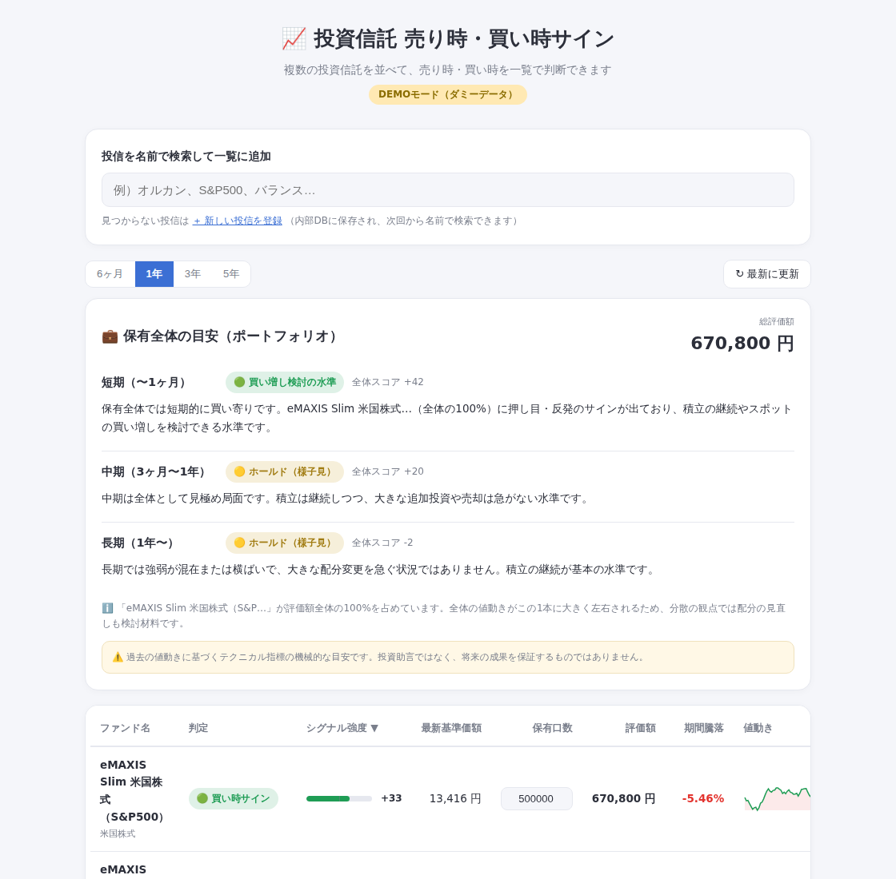
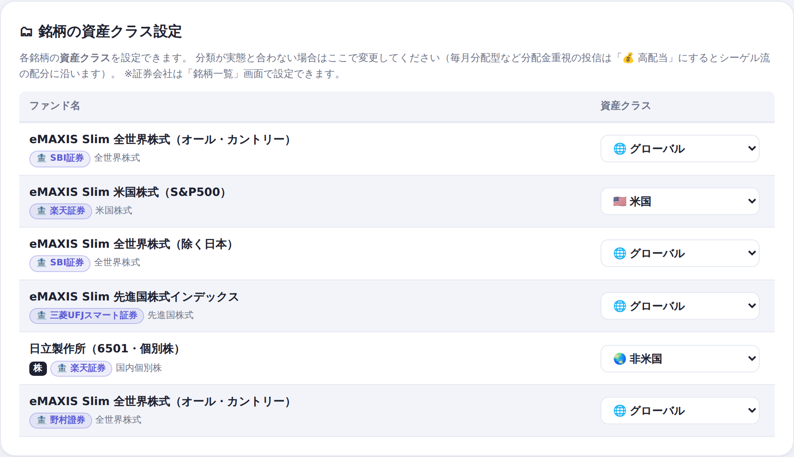
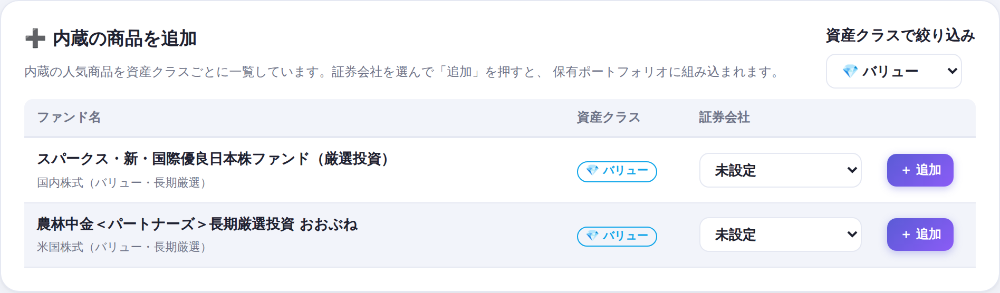
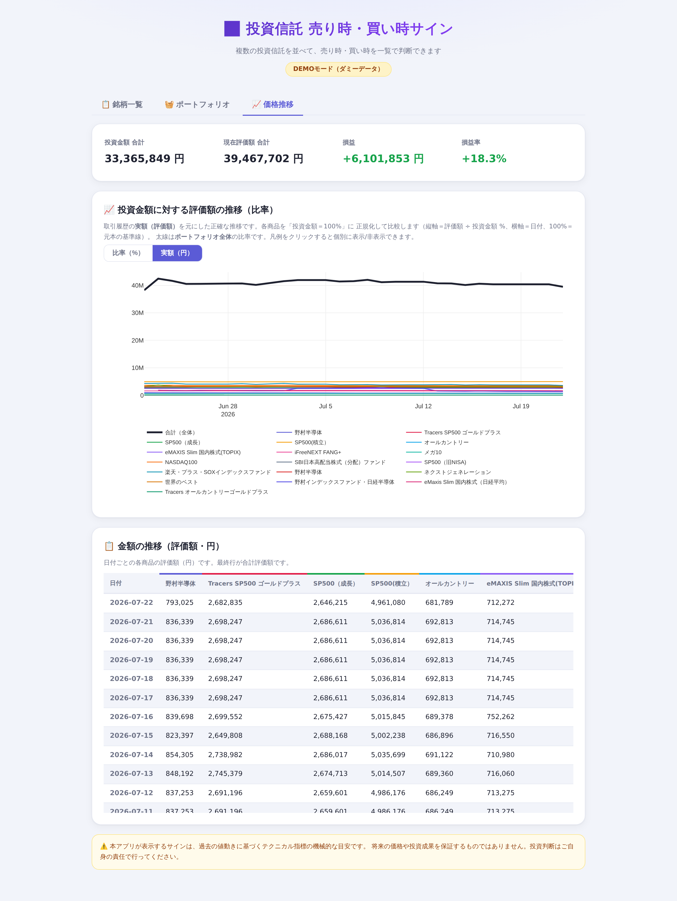
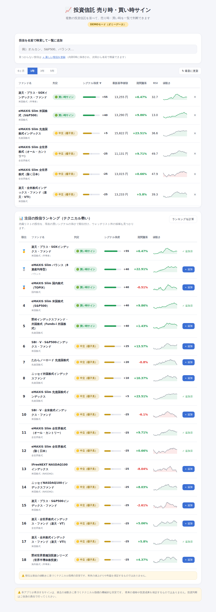
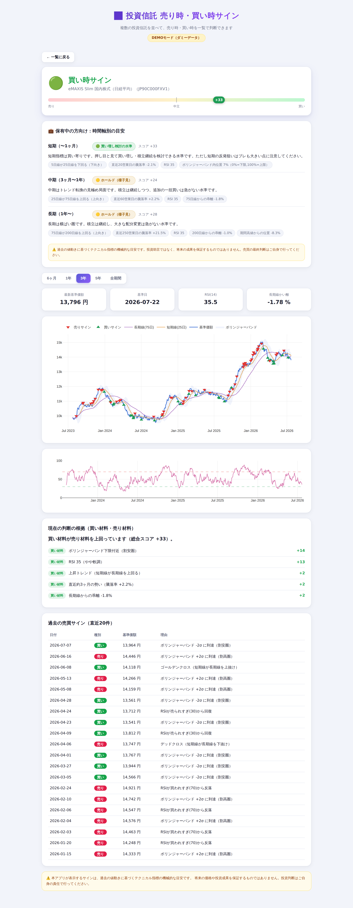

# 📈 投資信託 売り時・買い時サイン（Mac用ローカルWebアプリ）

複数の投資信託を**一覧で並べて**、過去の基準価額から売り時・買い時のサインを比較・判断できるMac向けのローカルWebアプリです。投信は**名前で検索**でき、一覧は**内部DB（SQLite）**に保存されます。



## できること

- 🗂 **一覧で売買判断**：ウォッチリストに登録した複数の投信を横並びで比較。判定（🟢買い/🔴売り/🟡中立）・シグナル強度・最新基準価額・期間騰落率・RSI・ミニチャートを一覧表示。列クリックで並べ替え（シグナル強度順など）
- 🔎 **名前で検索**：投信を名前で検索して一覧に追加（人気投信を内蔵。候補が複数あれば一覧から選択）。見つからない投信は登録すると内部DBに保存され、次回から名前で検索できます
- 📊 **注目の投信ランキング（テクニカル勢い）**：内蔵の全投信を現在の買いシグナルの強さで順位付け。ウォッチリスト外の“注目候補”をワンクリックで追加できます（※将来の利益を保証するものではありません）
- 💾 **内部DBに格納**：投信カタログ・ウォッチリスト・価格キャッシュを SQLite（`funds.db`）に保存。取得した基準価額はキャッシュされ、再表示が高速
- 📈 **詳細分析**：一覧の行をクリックすると、値動きグラフ（基準価額＋移動平均線＋ボリンジャーバンド）、売買サインのマーカー、RSIサブチャート、判断根拠、過去サイン一覧を表示
- 💼 **保有者向け 時間軸別の目安**：保有している前提で、短期（〜1ヶ月）・中期（3ヶ月〜1年）・長期（1年〜）それぞれについて「買い増し検討／ホールド／一部売却検討」の水準と具体的なコメントを表示。時間軸ごとに異なる指標（短期=RSI・ボリンジャー、中期=移動平均クロス、長期=200日線・高値からの位置など）で判定します（※投資助言ではなくテクニカルの機械的な目安です）
- 🧭 **資産配分とリバランス**：保有商品を6分類（🇺🇸米国／🌐グローバル／🌏非米国／💰高配当／🚀高リターン／💎バリュー）に自動分類し、一覧にアイコン表示。現在の配分と理想の配分を**円グラフ**で並べて表示し、クラスごとに「✅適正／⬆️買い足し／⬇️減らす」のリバランス指標と目安金額を表示します
- 📚 **理想配分はシーゲル流が初期値**：『株式投資の未来』（ジェレミー・シーゲル）の考え方をベースに、インデックス50%（米国30＋非米国20）＋補完リターン50%（高配当・グローバル・高リターン・バリューを各12.5）を初期設定に採用。ワンクリックの**プリセット（📚シーゲル流／⚖️バランス型）**と手動編集で自由に調整できます。毎月分配型など分配金重視の投信は**💰高配当**に分類しています
- 🏷 **資産クラスの設定（表形式）**：ポートフォリオ画面の「銘柄の資産クラス設定」表で、各銘柄の**資産クラス**をプルダウンで設定できます。自動分類が実態と合わない場合の変更は配分・リバランス計算へ即反映されます
- 🏦 **証券会社別に登録・同一商品を複数口座で保有**：各保有に証券会社（**SBI証券／楽天証券／三菱UFJスマート証券／野村證券**）を設定できます。**銘柄一覧のプルダウンから変更**でき、**同じ商品を複数の証券会社で保有**することも可能（証券会社を選んで追加すると別口座の保有として一覧に並びます。口数・投資金額・売却属性も保有ごとに個別管理）
- 📈 **価格推移タブ（取引履歴・実額ベース）**：取引履歴の**実額（評価額）**を元にした正確な推移。上部に〈投資金額合計／現在評価額合計／損益／損益率〉のサマリ、グラフは**比率（%）／実額（円）を切替**（比率は投資金額＝100%正規化、太線＝ポートフォリオ全体、凡例クリックで個別表示）、その下に**金額の推移（評価額・円）**を日付×商品の表で表示。取り込み時に明らかな**外れ値（桁落ち等）は自動除去**します
- 🧮 **過去の評価額は「その日に持っていた口数」で計算**：グラフ・表の過去の日付には、いまの口数から売買の記録を**さかのぼって復元した口数**を使います。いまの口数を過去にも掛けると、積立で買い増すたびに**過去の評価額まで増えてしまう**ためです（3万円の積立が翌日から過去に遡って6万円になる）。売買の記録が一部しか無くても、**記録のある増減だけ**は正しく反映します（記録が1件も無ければ従来どおり現在の口数）。売り切った日より後は表・グラフから消えます
- 📉 **比率（%）の分母もその日の投資金額**：価格推移の比率グラフは「その日の評価額 ÷ **その日の取得原価**」で描きます。いまの投資金額で過去まで割ると、**売る前の口数が多かった期間の比率が数百%に跳ね上がり**、他の商品の線が潰れて読めなくなるためです。売買の記録が無い商品はこれまでどおり投資金額は一定です
- 🏦 **取引CSVの取り込みは口座区分ごと**：CSVの行を「商品名＋口座区分（特定/NISA）」でまとめ、**口座が一致する保有**へ自動で割り当てます。同じ商品を特定口座とNISA口座の2行で持っている場合に、**両方の取引が片方の保有へまとめて入る**（口数・取得原価が実際の数倍になる）のを防ぎます。取り込み画面には行ごとに口座のバッジが出ます
- 🚨 **口数と実際の評価額の食い違いを警告**：取り込んだ評価額（実額）と、口数・売買の記録から計算した評価額が **1.8倍以上／0.55倍以下（かつ差が20万円以上）** ずれている保有を、価格推移タブの上部で知らせます。取引CSVを別口座の保有へ取り込んでしまったときなど、画面には数字が並ぶだけで気づけないためです（例：実額68万円に対し計算616万円）
- 📝 **口数を変えると「売買として記録しますか？」と確認**：銘柄一覧の口数を書き換えたとき、増減を**その日の売買**として記録できます（日付・単価・手数料を入力。単価はその日の基準価額を初期表示）。記録すると日付が入るので、**変更した日より前の評価額は書き換わりません**。投資金額（取得原価）も購入なら買った金額を加算、売却なら平均取得単価で按分して減らします。「口数だけ変更する」を選べば従来どおりの動作です
- 🔗 **銘柄一覧と実額ポートフォリオを統合**：取引履歴（`portfolio_seed.json`）を初回起動時に取り込み、**銘柄一覧＝価格推移＝同じ保有**になります。銘柄一覧では各保有の**評価額・損益率**も表示。同一ファンドを複数口座で保有する場合も口座名（表示ラベル）で区別します
- 🔄 **ページロード時に当日評価額を自動更新**：起動（ページ表示）のたびに各商品の現在価格を取得し、**画面で入力した口数 × 現在価格**で当日の評価額を計算して表示・履歴に反映します（過去の実額は上書きしません）。口数は**銘柄一覧で入力した値を使用**します（自動推定はしません）。口数が未入力の商品は、取り込んだ履歴の最新評価額で表示します
- 🔢 **数値入力は3桁カンマ表示**：口数・投資金額の入力欄は、入力しながら自動で3桁ごとにカンマ区切り表示します
- ➕ **内蔵の商品をポートフォリオ画面から追加**：ポートフォリオ画面の「内蔵の商品を追加」で、内蔵の人気商品を資産クラスごとに一覧・絞り込みし、証券会社を選んでワンクリックで追加できます。バリュー系（農林中金おおぶね／スパークス厳選投資）や高配当系（楽天・SCHD／日経平均高配当利回り株ファンド）など約38本を内蔵
- 🔒 **売却属性でリバランスを制御**：各商品に「○売却可／△一部売却可（最大50%）／✕売却不可」を設定でき、リバランス計画はこの設定を厳守します。加えて**長期上昇トレンド（値上がり予測）の商品は無理に売却しない**判定つき。除外した銘柄と理由も計画に表示されます
- 🔁 **リバランスの売買アドバイス**：どの商品を約いくら売却し、その資金でどの商品を購入すべきかを具体的に提示。売却はテクニカルで高値圏（売り時）の銘柄を優先し、安値圏の銘柄は「今売ると損になりやすい」ため対象から除外。売却候補が全て安値圏なら**無理にリバランスせず「見送り」**を提案します。乖離が±5pt以内なら「必要なし」と表示（※取得単価は未登録のため、実際の損益ではなくテクニカルな高値圏/安値圏で判断します）
- ✅ **全額売却した商品は一覧・価格推移から外す**：買った記録があり、売り切って口数が残っていない商品は、銘柄一覧とグラフ・表から自動で外します。口数が0でも「まだ入力していない」だけのことがあるため、**取引履歴で売り切ったと分かるものだけ**を対象にします（未入力の商品が黙って消えないように）。実現損益は残る情報なので、件数と合計を下に表示し、「表示する」でいつでも戻せます。**買い直すときは注目ランキング・検索から「＋ 再び追加」**で新しい保有として追加できます（売却済みの記録＝実現損益はそのまま残ります）
- 🏭 **個別株にも対応**：日立製作所（6501）を内蔵（株価はStooqの公開CSVから取得、評価額=株価×株数）。ポートフォリオに自動で組み込まれます



- 🧺 **「ポートフォリオ」メニューで調整に集中**：画面上部のタブが「📋 銘柄一覧」と「🧺 ポートフォリオ」に分かれ、ポートフォリオ画面には〈保有全体の目安〉〈資産配分の円グラフ〉〈リバランスの売買アドバイス〉〈理想配分の編集・プリセット〉〈銘柄の資産クラス調整〉をまとめました。一覧の「保有口数」を入力すると各ファンドの**評価額**（基準価額×口数÷10,000）と**総評価額**を表示。保有全体を評価額で加重して、短期・中期・長期それぞれの全体アドバイス（どの銘柄が過熱/押し目か、評価額の何%を占めるか等）を表示します。1本への集中が大きい場合は分散の注意も表示。口数未登録なら等ウェイトで評価します

- ⚡ **「最新に更新」は1銘柄ずつ取得**：全銘柄を1リクエストにまとめると、銘柄数 × 取得時間が積み上がって数十秒〜数分かかり、**ブラウザが待ちきれず接続を切ります**（iPadで「Load failed」）。1銘柄ずつ（同時3件まで）取り直して**「価格を取得中… 7/19」と進捗を表示**し、1回のリクエストを短く保ちます。途中で切れても押し直せば**続きから**更新できます（直前10分以内に取得済みの銘柄は取りに行きません）。取得できなかった銘柄は件数を知らせ、1件の失敗で更新全体が止まらないようにしています
- 🏢 **退職一時金・企業年金をプランに反映**：設定に〈退職一時金（受取年齢・金額）〉と〈企業年金（開始年齢・月額・受給年数／0で終身）〉を追加しました。一時金は受け取る年齢に現金へ加算し、企業年金は受給期間だけ毎月の収入として扱います。公的年金と違い**物価スライドが無いのが一般的なので名目のまま**（インフレでは増えない＝実質は目減りする）計算です。年齢ごとの表では「公的年金」と「企業年金」を**列を分けて**表示し、手元に置きたい現金の③無年金クッションからも、その期間に受け取る企業年金・一時金を差し引きます
- 📋 **今年の取り崩し指示書**：取り崩し戦略タブに、これから1年で〈生活費／年金でまかなう額／分配金／現金・債券から／**売却が必要な額**〉を出し、その売却額を**どの口座のどの商品からいくら売るか**に割り当てます。**NISA温存**（特定口座から先に売る）、**売却不可は売らない・一部売却可は50%まで**、同じ口座では**売り時→中立→安値圏**の順、という①②と同じルールで割り当て、商品ごとに**含み益・概算の譲渡益税・手取り・売却後の残り**まで出します（税は売却額×含み益の割合×税率の概算）
- 💰 **年齢ごとの取り崩し額に「資産残高」列**：各年齢の行の右端に、その年齢になった時点（年初・取り崩す前）の**資産残高**（現金＋債券＋投信・株、特定口座の含み益にかかる税を引いた後）を万円で表示します。退職年齢の行は本文の「退職時の想定資産」と一致し、「今日の価値で表示する」にすると残高も実質額になります。資産が尽きてその年齢に届かない場合は「—」です
- 🎲 **取り崩し戦略タブは「決める材料2つ・結果2つ」**：条件が増えても迷わないよう、変えられるのは〈**取り崩し方法**（設定タブ）〉と〈**集中している銘柄を残す割合**〉の2つだけ、結果は〈**① 年齢ごとの取り崩し額**〉と〈**② 値動きのブレを含めた成功確率**〉の2つに集約しています。方法ごと・残す割合ごとの比較、暴落シナリオは②の中に折りたたんであり、必要なときだけ開けます。上の2つを変えると①②がすべて連動します
- 🎲 **1銘柄への集中は「残す割合」を設定して反映**：資産の15%以上を1銘柄が占めているとき、設定の**「集中している銘柄を残す割合（%）」**（既定100＝売らずにそのまま）でその後の扱いを決めます。指定した割合まで年360万円ペースで売り、**同額を分散資産に買い直す**前提（NISAの残り枠を先に使用、売却益には課税）で①②を計算します。集中銘柄の変動率・それ以外の変動率・両者の相関を実際の価格から測り、残す割合に応じた合成の変動率 σ＝√(w²σ銘柄²＋(1−w)²σその他²＋2w(1−w)ρσ銘柄σその他) を月ごとに使ってモンテカルロを回します（勤務先の株の場合、給与・退職金も同じ会社に依存するぶん実質のリスクはこれより大きくなります）
- 🏛 **年金はインフレより緩やかに増やす（マクロ経済スライド）**：公的年金は物価上昇をそのまま反映しない仕組みのため、生活費と同率で増やすと楽観的になります。設定の**「年金のスライド調整（%）」**（既定0.4）でインフレ率から差し引いた率で年金を増やします（インフレ2%・スライド0.4%なら年1.6%）。**名目額は下がらない**ようにしてあり（0が下限）、0にすればインフレと同率＝従来どおりの前提に戻せます
- 🚦 **ガードレール運用のサポート（ガードレール選択時のみ）**：取り崩し戦略タブに「ガードレールの現在地」カードが出ます。〈基準の引出率／いまの引出率／判定（減額・据え置き・増額）〉をタイルで表示し、帯のどこにいるかを1本のバーで示します。**「あと◯◯万円 資産が減ると減額（生活費 30万→27万）」「あと◯◯万円 増えると増額」**と、次に判定が変わる資産額まで具体的に出すので、年1回の見直しがそのまま実行できます。「基準をいまの資産で決め直す」で退職時の基準を記録し、「判定を反映する」で生活費を1段階（±10%）動かせます。**記録した基準と採用中の生活費は①②の試算にも反映される**ので、画面の現在地とシミュレーションがズレません。前回の見直し月を覚えていて、1年経つと「時期です」と知らせます
- 🤖 **取り崩し方針をAIに相談**：取り崩し戦略タブの「🤖 AIに方針を相談」で、**画面に出ている試算値そのもの**（前提・集中銘柄・3方式の資産寿命と成功確率・暴落シナリオ）をClaudeに渡し、〈おすすめの方針／その理由／逆を選んだ場合／見落としやすい点〉を返します。サーバで計算し直さないので、**画面の数字とAIのコメントが食い違いません**。相談のときは、いま設定している方針だけでなく**選べる方針すべての試算値**（残す割合6通り×同じ乱数列）を渡し、「いまの設定だから」という理由で現状を勧めないよう指示しています。**乱数の種は固定**なので、同じ前提なら何度計算しても同じ結果になり、設定を変えたときだけ結論が動きます。前提を変えて再計算すると古い助言は消えます（設定でAIをオンにしている場合のみボタンが出ます）













データ源は投資信託協会の公式「[投信総合検索ライブラリー](https://toushin-lib.fwg.ne.jp/)」の基準価額CSVです。

## 使い方（かんたん・Mac）

1. このフォルダ内の **`run.command`** をダブルクリック。
   - 初回だけ自動でセットアップ（Python仮想環境＋ライブラリ導入）が走ります。
   - 「開発元が未確認」と出たら、`run.command` を右クリック →「開く」を選んでください。
2. 自動でブラウザが開きます（既定 `http://127.0.0.1:8765`。使用中なら自動で別ポート）。
    - 自動で開かない場合は、Terminalに表示されるURLをブラウザに貼り付けてください。
3. 最初から人気投信がいくつか一覧に入っています。検索欄から投信を追加・削除できます。

> Python 3 が必要です。入っていない場合は [python.org](https://www.python.org/) から入れてください。

### 「開発元が未確認のため開けません」と出る場合（ダウンロードした直後）

zipをダウンロードして展開すると、中の `.command` ファイルに macOS が**検疫フラグ（quarantine）**を付けます。
署名していない自作スクリプトなので Gatekeeper が止めますが、**開けるようにする方法は3つ**あります。
zipを新しく落とし直すたびに付き直すので、繰り返すなら方法3が楽です。

**方法1：右クリックから開く（1回だけ許可）**

`run.command`（または `run-lan.command`）を**右クリック →「開く」**→ 確認ダイアログで**「開く」**。
ダブルクリックと違い、この経路なら実行を許可できます。

**方法2：システム設定から許可**

ダイアログで「OK」を押した直後に、 **システム設定 → プライバシーとセキュリティ** を開き、
下の方に出る「"run-lan.command" は開発元を確認できないため、使用がブロックされました」の横の
**「このまま開く」**を押します（Touch ID かパスワードを求められます）。

**方法3：検疫フラグをまとめて外す（おすすめ・ターミナル）**

ターミナル（アプリケーション → ユーティリティ → ターミナル）を開き、`xattr -dr com.apple.quarantine ` まで入力してから、
**Finderの `fund-timing` フォルダをターミナルのウィンドウにドラッグ&ドロップ**して Enter：

```bash
xattr -dr com.apple.quarantine /Users/あなた/Downloads/fund-timing
chmod +x /Users/あなた/Downloads/fund-timing/*.command   # 実行権限が落ちている場合
```

フォルダ内すべての検疫フラグが外れ、以後はダブルクリックで起動できます。

> ターミナルから直接 `bash run-lan.command` と実行する場合は、そもそも Gatekeeper のブロックを受けません。

### 「127.0.0.1 へのアクセスが拒否されました」と出る場合

macOS の「AirPlay受信」機能がポート **5000** を使っているのが主な原因です。
本アプリは既定でポート **8765** を使い、使用中なら自動で空きポートに切り替えるので、
Terminal に表示される実際のURL（`http://127.0.0.1:8766` など）を開いてください。
ポートを指定したい場合は `python app.py --port 8080` のように起動できます。

### ターミナルから起動する場合

```bash
cd fund-timing
python3 -m venv .venv
source .venv/bin/activate
pip install -r requirements.txt
python app.py          # ブラウザが自動で開きます
```

### ネットなしで画面だけ試す（デモ）

```bash
python app.py --demo   # ダミーデータで動作（DBは funds.demo.db を使用）
```

### 他の端末（スマホ等）からアクセスする

通常は自分のMac内（`127.0.0.1`）だけで動くため、**他端末からアクセスできるURLはありません**。
同じWi-Fi内の他端末からも見たい場合は、LAN公開モードで起動します。

- かんたん：**`run-lan.command`** をダブルクリック。
- ターミナルから：`python app.py --lan`

起動すると、他端末で開くURLが表示されます（例）：

```
📱 他の端末（同じWi-Fi）からは次のURLを開いてください：
    http://192.168.1.23:8765
```

この `http://<MacのIP>:8765` を、**同じWi-Fiにつないだスマホ等のブラウザ**で開いてください。

> 注意：LAN公開モードでは、同じネットワーク内でこのURLを知っている端末は誰でも閲覧・操作できます（認証はありません）。
> 使い終わったら Ctrl+C で停止してください。macOSで初回は「ネットワーク受信を許可しますか？」と聞かれたら許可します。

## 投信の探し方・登録方法

まず内蔵の人気投信（`seed_funds.py`。eMAXIS Slim・楽天・SBI・V・ニッセイ・たわら・iFreeNEXT・FANG+・Tracers・ひふみ・野村・アライアンス・バーンスタインなど30本超）が名前検索の対象です。ここに無い投信は、コードを入れれば登録でき、以降は名前で検索できます。

- **名前で検索**：検索欄に「オルカン」「S&P500」「NASDAQ」「FANG」「SOX」「ひふみ」「半導体」「メガ10」等を入力（`/`キーで検索欄にフォーカス、↑↓で候補選択・Enterで追加） → 候補が複数出るので選んで「＋ 一覧に追加」。
- **見つからない投信を登録**：「＋ この投信を登録する」から、名前と次のいずれかを入力して登録します。
  - **協会コード（8桁）のみ**：`01313098`（★おすすめ。これだけで取得できます）
  - **ISINと協会コードの両方**：`JP90C0006G52,01313098`
  - **投信協会ライブラリーのCSVダウンロードURL**：`isinCd=...&associFundCd=...` を含むもの

> 投信協会のCSVは「協会コード（8桁）」を主キーにしているため、**ISINだけでは取得できない投信があります**。
> その場合は協会コードを使ってください（みんかぶ/Yahooファイナンスで投信名を検索すると、URLや見出しの8桁コードが協会コードです）。

### コード（ISIN・協会コード）の調べ方

- **協会コード（8桁）**：[みんかぶ投資信託](https://itf.minkabu.jp/) や [Yahoo!ファイナンス](https://finance.yahoo.co.jp/) で投信名を検索。
  URLや見出しに出る **8桁のコード（例 `0131410B`, `9I315241`）が協会コード** です。
- **ISIN（12桁）**：証券会社（例：楽天証券）のファンド詳細ページのURLにある **`JP90…` で始まる12桁** がISINです。

**URLを貼り付けるだけでもOK**：登録欄には、みんかぶ／Yahoo!ファイナンス／日経／証券会社のファンドページの
**URLをそのまま貼り付け**られます（アプリがコードを自動抽出）。
みんかぶ等のURL（協会コード）と楽天証券のURL（ISIN）を**両方まとめて貼り付け**れば、両方のコードが埋まります。

### 登録内容の保存先（更新しても引き継がれます）

登録した投信・ウォッチリスト・キャッシュは、アプリのフォルダ内ではなく
**`~/.fund-timing/funds.db`（ホーム直下）** に保存されます。
そのため、**アプリのフォルダを新しい版に入れ替えても、登録内容はそのまま引き継がれます**。
（旧バージョンがフォルダ内に作った `funds.db` があれば、初回起動時に自動で引き継ぎます。）

### データが取得できないとき（診断）

登録はできたのに基準価額が表示されない・「データが空でした」と出る場合、次のコマンドで
サイトからの実際の応答を確認できます（ターミナルで実行）：

```bash
cd fund-timing
./.venv/bin/python app.py --check "JP90C0002EX1,18312991"
```

HTTPステータス・応答の先頭・解析結果が表示されます。この出力を見れば、
「コードが違う」「サイトがアクセス制限している」「データ形式が想定と違う」などの
切り分けができます。

**個別株（日立などの株価）が更新されないとき**は、専用の診断を使ってください。
`check.command` をダブルクリックするか、ターミナルで次を実行します。

```bash
cd fund-timing
./check.command            # 保有している株を全部調べる
./check.command 6501.JP    # ティッカーを指定して調べる
```

`.venv` が無ければ自動で作るので、パスを気にせず実行できます。
取得元（Stooq / yfinance / Yahoo）ごとの最終日、キャッシュの最終日と取得時刻、
アプリが実際に返している値が並ぶので、原因が **取得元・キャッシュ・表示** の
どれにあるかが分かります。

> `app.py` を起動したままファイルを差し替えても、Pythonは読み直しません。
> 修正を反映するには、ターミナルで `Ctrl+C` → もう一度起動してください。

> **なぜ全投信を自動検索できないの？**
> 投信協会の「投信総合検索ライブラリー」は、**利用規約でロボットによる自動データ収集（スクレイピング）を禁止**しています。
> そのため本アプリは全ファンド一覧の自動取得は行わず、内蔵カタログ＋手動登録の方式にしています。
> （各ファンドの基準価額CSVは公式に提供されたダウンロード機能なので、指定した投信の取得には利用しています。）

登録した投信は内部DB（`funds.db`）に保存され、次回以降も名前で検索できます。
初期カタログ（`seed_funds.py`）を編集すれば、最初から並ぶ投信を増やせます。

## サインの見方（テクニカル指標）

| 指標 | 買いサイン | 売りサイン |
| --- | --- | --- |
| 移動平均クロス | ゴールデンクロス（短期が長期を上抜け） | デッドクロス（短期が長期を下抜け） |
| RSI(14) | 売られすぎ(30)から回復 | 買われすぎ(70)から反落 |
| ボリンジャーバンド(20,±2σ) | −2σ到達（割安圏） | +2σ到達（割高圏） |
| 長期線かい離率 | 大きく下方乖離 | 大きく上方乖離 |

一覧の「シグナル強度」（−100〜+100）は上記を合算した総合スコアで、+30以上で「買い時」、−30以下で「売り時」、その間は「中立」と表示します。
パラメータ（移動平均の日数など）は `signals.py` の先頭で調整できます。

### 一覧の「判定」と、上部の「短期の売り時／買い時」は別の指標です

同じ銘柄でも並ぶ内容が一致しないのは、見ている期間と重みが違うためです。

| | 上部のサマリー | 一覧の「判定」 |
| --- | --- | --- |
| 期間 | **短期（〜1ヶ月）** | **中期**（直近75営業日中心） |
| 移動平均 | 5日 / 25日 | 25日 / 75日 |
| モメンタム | 20営業日 | 約60営業日 |
| 重み | RSI 32・ボリンジャー 28（**逆張り**寄り） | トレンド 28・モメンタム 22・乖離率 12（**順張り**寄り） |
| しきい値 | ±30 | ±30 |

短期は「一時的に売られすぎ／買われすぎか」、中期は「トレンドとして上向きか下向きか」を見ます。
そのため「中期では売り時だが、短期はまだ過熱していない」といった食い違いが普通に起こります。

## ⚠️ 免責

本アプリのサインは、過去の値動きに基づくテクニカル指標の**機械的な目安**です。
将来の価格や投資成果を保証するものではありません。投資判断はご自身の責任で行ってください。

## ファイル構成

| ファイル | 役割 |
| --- | --- |
| `app.py` | Flaskアプリ本体（サーバ・ルーティング・入力解析・キャッシュ制御） |
| `db.py` | 内部DB（SQLite）：カタログ・ウォッチリスト・価格キャッシュ |
| `seed_funds.py` | 内部DBの初期カタログ（人気投信） |
| `fund_data.py` | 投信協会CSVの取得・整形 |
| `signals.py` | テクニカル指標と売買サインの算出 |
| `demo_data.py` | デモ用ダミーデータ生成 |
| `templates/index.html`・`static/` | 画面（HTML/CSS/JS、Plotly.js同梱で配信） |
| `run.command` | Mac用ダブルクリック起動ランチャー |
| `check_stock.py`・`check.command` | 株価がどこまで取得できているかの診断 |
| `market_mix.py`・`market.command` | 保有の中身を市場ポートフォリオ（時価総額比）と比べる計算 |
| `nisa_shift.py`・`nisa.command` | 集中している銘柄をNISAへ移す計画の試算 |

## 内部DB（SQLite）の構造

| テーブル | 内容 |
| --- | --- |
| `catalog` | 投信の一覧（名前・ISIN・協会コード・分類）。名前検索の対象 |
| `watchlist` | 一覧に並べる投信（catalog を参照） |
| `cache` | 取得済みの基準価額シリーズ（JSON、12時間キャッシュ） |
